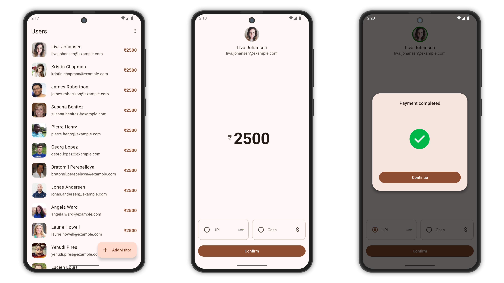

# UserPayTracker

UserPayTracker is a Kotlin-based mobile application designed to retrieve and display user details
from an API. Users can update their payment methods and add visitors, with payment tracking
features. The app follows the MVVM architecture and includes offline caching using Room.

## **Screenshots**

<picture>
  <source media="(prefers-color-scheme: dark)" srcset="screenshots/screenshot-dark.png">
  <source media="(prefers-color-scheme: light)" srcset="screenshots/screenshot.png">
  
</picture>

## Features

### User Data Retrieval

- Fetch user details from the
  API: [RandomUser API](https://randomuser.me/api?page=1&results=20)
- Display user list with names, profile pictures, and payment status

### Payment Details Management

- Users can select a payment method: **Cash** or **UPI**
- Default payment amount is **₹2500** (editable)
- Profile picture gets a **green border** when payment is updated
- Display the user's name alongside the updated payment amount

### Visitor Addition

- Floating Action Button (**FAB**) to add visitors
- Fixed payment amount for visitors: **₹1000**

### Data Management

- Option to **clear all updated user and visitor data**

## Architecture & Tech Stack

- **MVVM (Model-View-ViewModel) Architecture**
- **Retrofit** for API calls
- **Room Database** for offline caching
- **LiveData** for real-time UI updates
- **RecyclerView** for displaying user lists
- **Material Design Components** for a user-friendly interface

## Installation & Setup

1. **Clone the repository**
   ```sh
   git clone https://github.com/yourusername/UserPayTracker.git
   cd UserPayTracker
   ```
2. **Create a keystore file**
    - Navigate to the `app` directory and create a keystore file (`your-keystore.jks`).
    - This file is required for signing the application.
3. **Set up the keystore properties before syncing the project**
    - Create a `keystore.properties` file in the project's root directory and add the following
      values:
      ```properties
      storePassword=your-store-password
      keyPassword=your-key-password
      keyAlias=your-key-alias
      storeFile=app/your-keystore.jks
      ```
    - Ensure that the file is referenced correctly in `build.gradle` to fetch the keystore details.
4. **Open in Android Studio**
5. **Sync Gradle and build the project**
6. **Run the application on an emulator or a physical device**

## API Reference

The app fetches user data from:

```
https://randomuser.me/api?page=1&results=20
```

## Known Limitations

- The app currently fetches a fixed number of users (100) from the API, which may not be scalable.
- Payment updates are stored locally, but there is no server-side persistence.

## Contribution Guidelines

1. Fork the repository
2. Create a new branch (`feature-branch-name`)
3. Commit your changes with meaningful messages
4. Push to GitHub and create a pull request

## Contact

For any queries or contributions, reach out
at [mubashirpa2002@gmail.com](mailto:mubashirpa2002@gmail.com)

## License

```
Copyright 2022 The Android Open Source Project

Licensed under the Apache License, Version 2.0 (the "License");
you may not use this file except in compliance with the License.
You may obtain a copy of the License at

    https://www.apache.org/licenses/LICENSE-2.0

Unless required by applicable law or agreed to in writing, software
distributed under the License is distributed on an "AS IS" BASIS,
WITHOUT WARRANTIES OR CONDITIONS OF ANY KIND, either express or implied.
See the License for the specific language governing permissions and
limitations under the License.
```